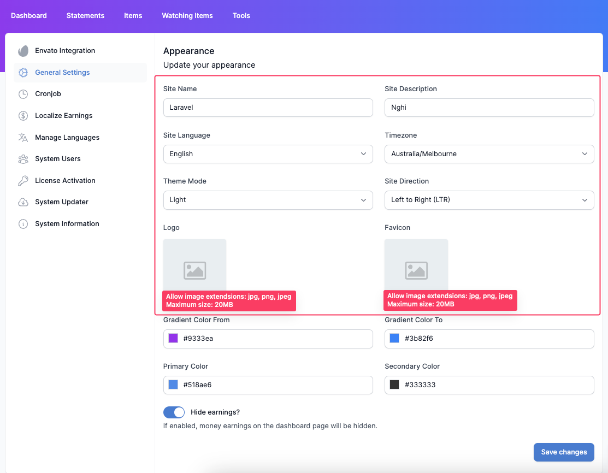
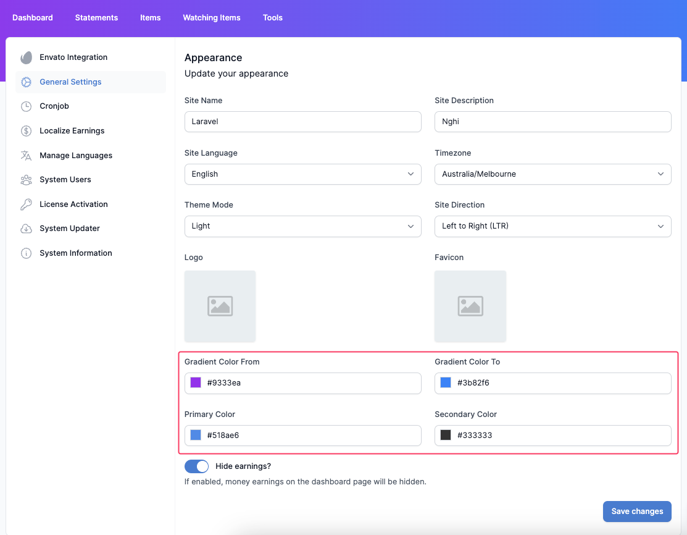

# Appearance

## Site configuration

Site configuration includes:

- **Site name**.
- **Site Description**.
- **Timezone**.
- **Theme Mode**:  System Mode, Light Mode, Dark Mode.
- **Site Direction**: Left to Right, Right to Left.
- **Site Language**: If you have only English. Go to [add new language](localization.md#adding-a-new-language) to import your language.
- **Logo**
- **Favicon**

## Color configuration

Gradient background color of header:
- **Gradient color From**
- **Gradient color To**

We also support selecting the color of buttons, selected sidebars, focused input, etc. through:
- **Primary Color**
- **Secondary Color**

## Display earnings option

We also support the option to **hide** or **show** earnings. If you don't mind your earnings always showing on the monitor, you can uncheck the hidden earnings option. In contrast, check the hidden earnings option to default hidden all earnings. 

