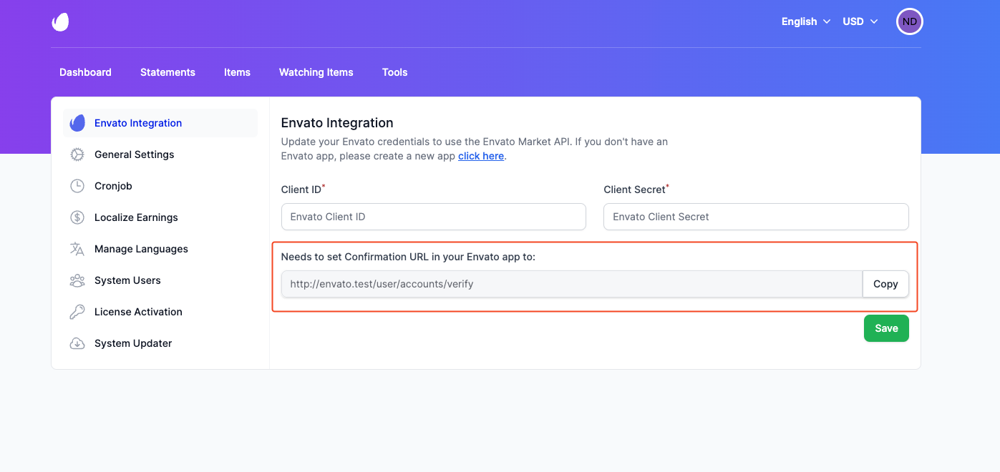
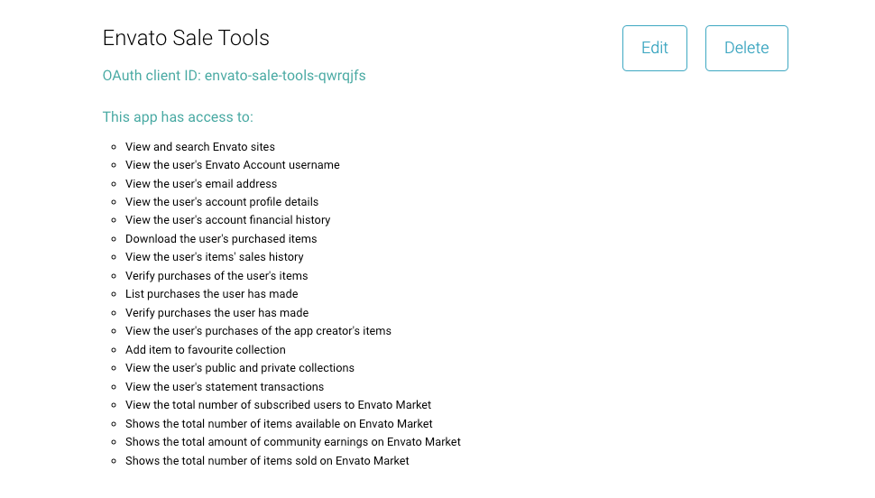
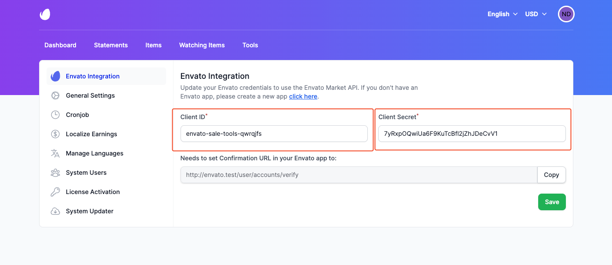
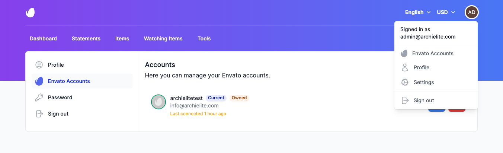
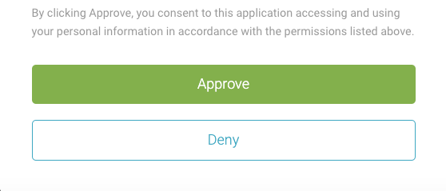
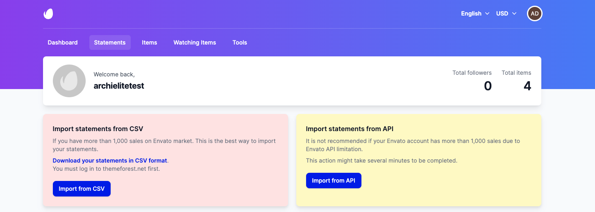
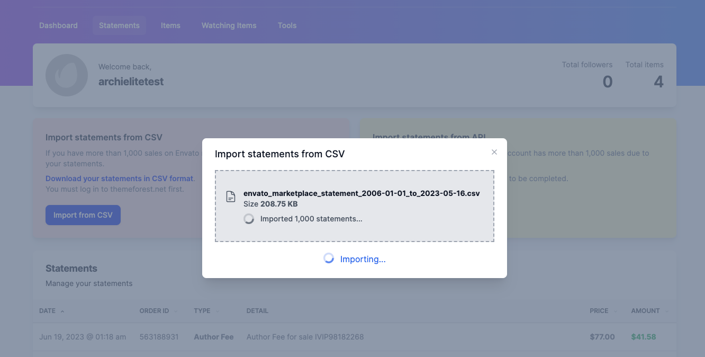
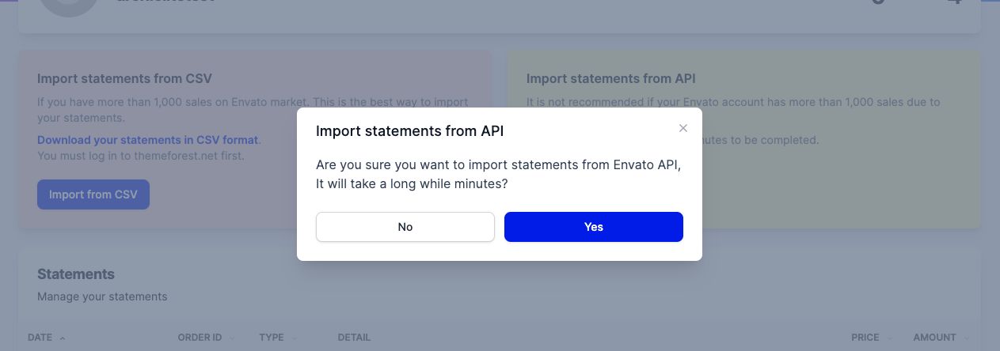

# Getting Started

## Configuring Envato credentials

To configure Envato credentials, please follow the instructions below:

- Go to the Envato Developers website at [build.envato.com](https://build.envato.com) and log in with your Envato
  account.
- Once you're logged in, click to **My app** from the header menu.
- On the **My apps** page, click on the **Register a new app** button.
- Fill the app name, check all the **Required permissions** and check the **Terms of conditions**.
- In the **Confirmation URL** field, enter the **Confirmation URL** from **Settings** -> **Envato Integration** page
  your Envato Sale Tools site.
  
- After you have filled in all the required fields, click on the **Register App** button.
- Once the app is registered, you will need to copy the **Client ID** and **Client Secret**
  from [build.envato.com](https://build.envato.com/my-apps/)
  site and paste them into the **Envato Integration** page on your Envato Sale Tools site.





## Connect to Envato Account



To track your Envato sales, you need to connect your Envato account to your Envato Sale Tools site. To do that, please
go to the **Envato Accounts** on the user dropdown menu and click on the **Connect New Account** button.

Then you will be redirected to the Envato Authorize page, click to the **Approve** button.



## Import Statements

On the first time you connect to your Envato account, you will need to import your statements. To do that, please go to
the **Statements** page.



We provide 2 ways _Import Statements from Envato API_ and _Import Statements from CSV file_. We recommend you to
**import statements from Envato CSV** file because it's don't need to wait for a long time to call the Envato API.

### Import from CSV file

If you have more than 1,000 sales on Envato market. This is the best way to import your statements.

First, you need to download the CSV file from your Envato account by going to the **Statement** page on your Envato
account.

Once you have downloaded the CSV file, click to the **Import from CSV** button and select the CSV file you have
downloaded. Then click to the **Upload** button.



You will see the below message if the CSV file is imported successfully.

```
Done. x,xxx statements has been imported.
```

### Import from Envato API

This way is similar to the _Import from CSV file_ way, but it will take a long time to import your statements due to
Envato API limitation. This way might take a few minutes or hours to import your statements if you have too many sales.



## Cronjob

Cron jobs are scheduled tasks that the system runs at predefined times or intervals. It helps to synchronize your Envato
sales with your site automatically.

### On Shared Hosting

If you are using shared hosting, you can read more about how to set up a cronjob
at [cPanel](https://docs.cpanel.net/cpanel/advanced/cron-jobs/).

### On VPS/Dedicated Server

If you are using VPS/Dedicated Server, you can follow the instructions below to set up a cronjob:

1. Go to your site's **Settings** -> **Cronjob** page, copy the cronjob command.
2. Open your server's terminal and run the command below to open the crontab file:
    ```bash
    crontab -e
    ```
3. Paste the cronjob command you copied from your site's **Settings** -> **Cronjob** page and save the file.
4. Now your Envato sales will be synchronized with your site automatically.
