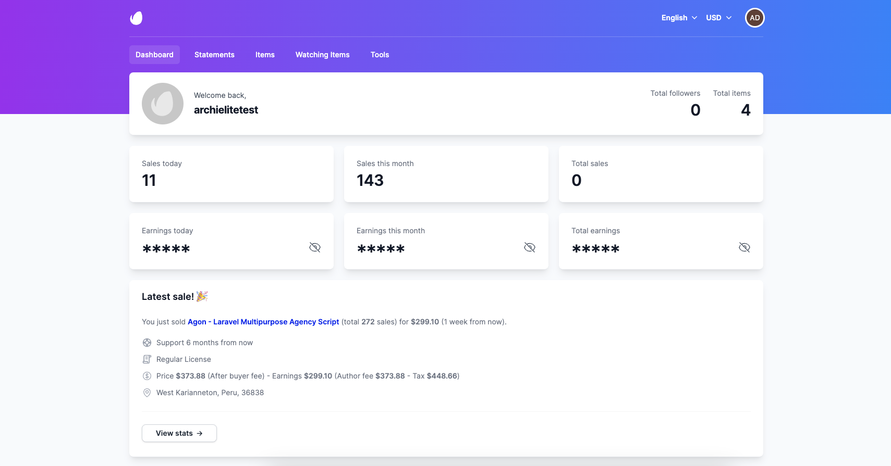

# Overview

## Introduction

**Envato Sale Tools** is a powerful tool for Envato authors to manage their sales. It provides a lot of features to
manage your sales, track your sales, analyze your sales, get notifications about your sales, and much more.

- Created: **2023-06-10**
- Current version: **1.0.0**
- Author: [Archi Elite](https://archielite.com)
- Email: contact@archielite.com

## Features

- **Easy installation with Wizard Installer**.
- **Instant Sale Notifications**: Support to get instant notifications about your sales via Telegram, Slack and
  WhatsApp.
- **Sales Tracking**: Support to track your sales and get detailed information about your sales.
- **Verify Purchase Code**: Easy to verify purchase code of your items.
- **Multiple Languages & Currencies support**.
- **Scriptable feature**: Scriptable help you create a widget on iOS that shows your revenues for this year, this month,
  and the total on your iPhone.
- **Tracking Sales From other Author's Items**.
- Fully responsively and mobile friendly.

## Demo

- Demo: [envato.archielite.com](https://envato.archielite.com)
- Username: `admin@archielite.com`
- Password: `12345678`

Thank you for purchasing this product. If you have any questions that are beyond the scope of this help file, please
feel free to email via [support page](https://support.archielite.com) for quickly support. Thank you so much!
