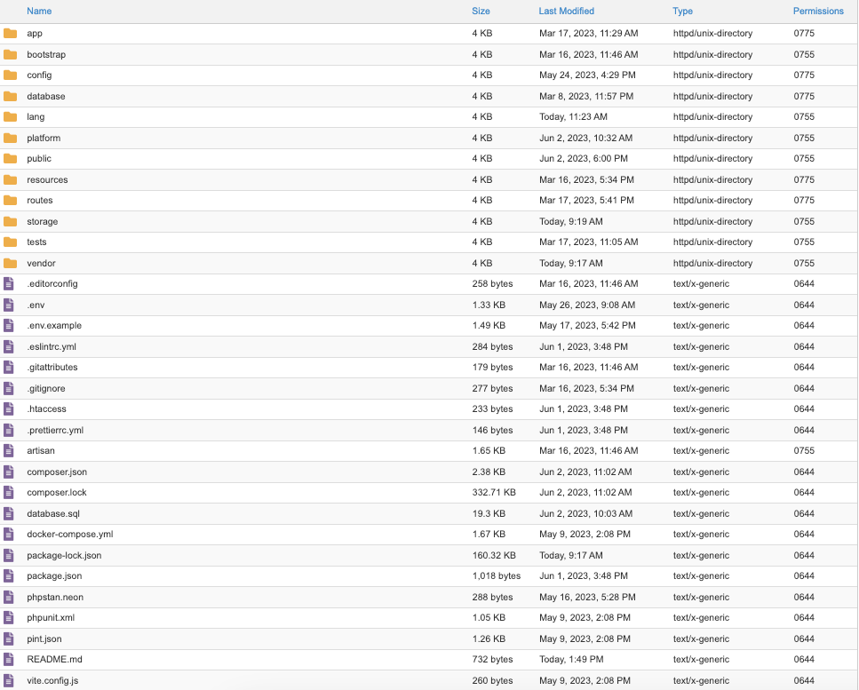

# Installation

## Server Requirements

Before you install Envato Sale Tools, make sure that your server meets the following requirements:

- Apache (with `mod_rewrite` enabled) or Nginx
- PHP 8.1 or greater (with `cURL`, `JSON`, `mbstring`, `OpenSSL`, `PDO`, `Tokenizer`, `zip` extensions)
- MySQL 5.7+ (>= 8.0 recommended) or MariaDB 10.3+.

:::tip
In the most servers (shared hosting, VPS, dedicated servers) these requirements are met by default. But you can always
check it with your hosting provider.
:::

## Installing

:::tip
We are providing free installation service. If you are not a technical users and cannot install our script, please
create a ticket on our [support center](https://support.archielite.com) and give us your hosting information, we will
install it for you for free.
:::

Follow these steps to install Envato Sale Tools:

1. Download the latest version of **Envato Sale Tools** from [CodeCanyon](https://codecanyon.net/downloads).
2. Once the download is complete, unzip the downloaded archive and upload all files and folders to the root directory of
   your server.
   
3. The root directory is typically named `public_html` on shared hosting or `www` on VPS/dedicated servers. You can use
   an FTP client (e.g., FileZilla) or a file manager provided by your hosting provider to upload the files.
4. After uploading, make sure to set the appropriate file permissions for Laravel. The following folders should have
   write permissions (typically `755` or `775`):
    - `.env`
    - `storage`
    - `bootstrap/cache`
5. Once the files are uploaded, open your website in a web browser, you should see the installation wizard.
6. Follow the instructions provided by the installation wizard to complete the installation process. Start setting up
   your database connection details, creating an admin account, and configuring other necessary settings.
7. Once the installation is complete, you should be able to access and use Envato Sale Tools by visiting your website.

::: warning
It’s based on **Laravel framework**, the root folder for it is `/public`. You shouldn’t install it on a sub-folder, use
subdomain is better than sub-folder. (we won’t support to install our product on sub-folder).
:::

## What’s Next?

After you have installed Envato Sale Tools, you can start setting up your Envato credentials and other settings. Please
refer to the [Getting Started](getting-started) section for more details.
