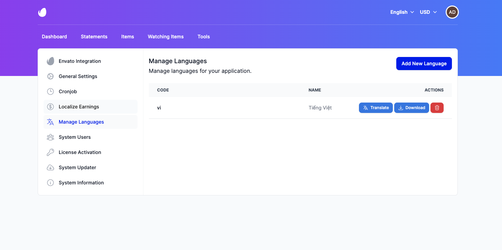
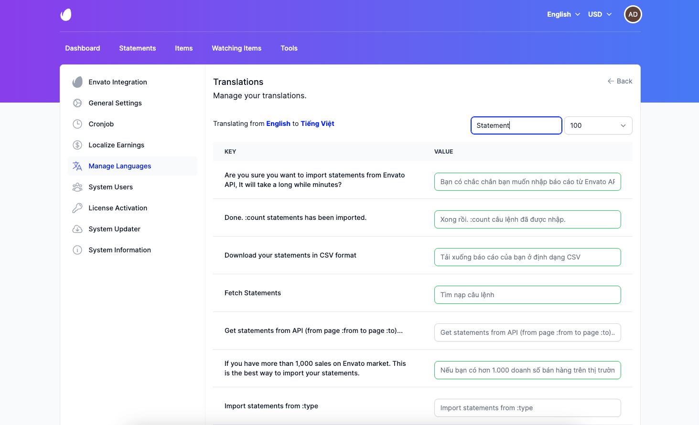
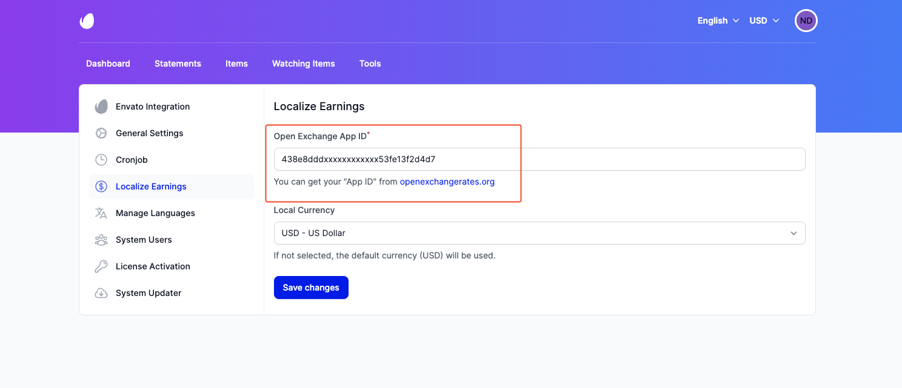

# Localization

## Introduction

The Localization allows you to configure various settings related to the localization of your website. This includes
language preferences and currency settings.

## Languages

It's easy to add a new language to your website.

### Adding a New Language

To add a new language, by go to **Settings** -> **Manage Languages** page, and click the **Add New Language** button.

It will open a dialog box where you can choose the language you want to add.

### Setting the Default Language

Once you have added a new language, you can set it as the default language for your website. You can do this by go to
**Settings** -> **General Settings**.

### Translating the Website

You can translate the website by clicking the **Translate** button next to the language you want to translate.

::: tip
Most of the language files are automatically translated using Google Translate. You also can contribute to the translations
by submitting a pull request on our [GitHub repository](https://github.com/archielite/envato-translations).
:::

## Currency

The Localize Earnings setting allows you to specify the default currency used for financial transactions within your
website. Default currency is USD.

To configure the Currency setting using **Open Exchange Rates**, follow these steps:

- Obtain an API key from the [Open Exchange Rates](https://openexchangerates.org) website.
- Go to Settings -> Localize Earnings page, and enter your API key in the `Open Exchange App ID` field.

You can also specify the default currency by selecting it from the **Local Currency** dropdown list.

