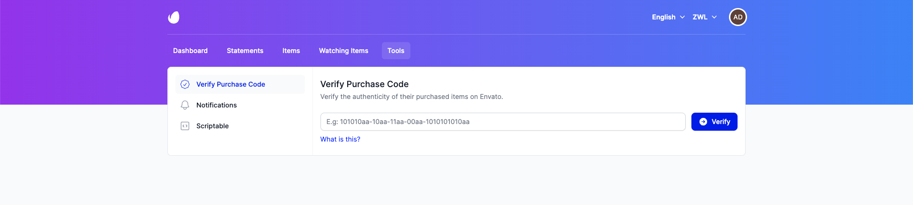
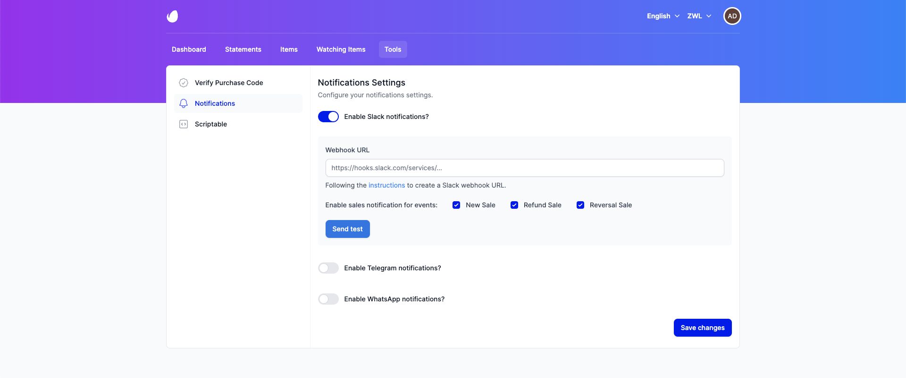
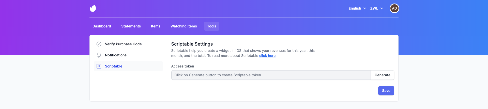
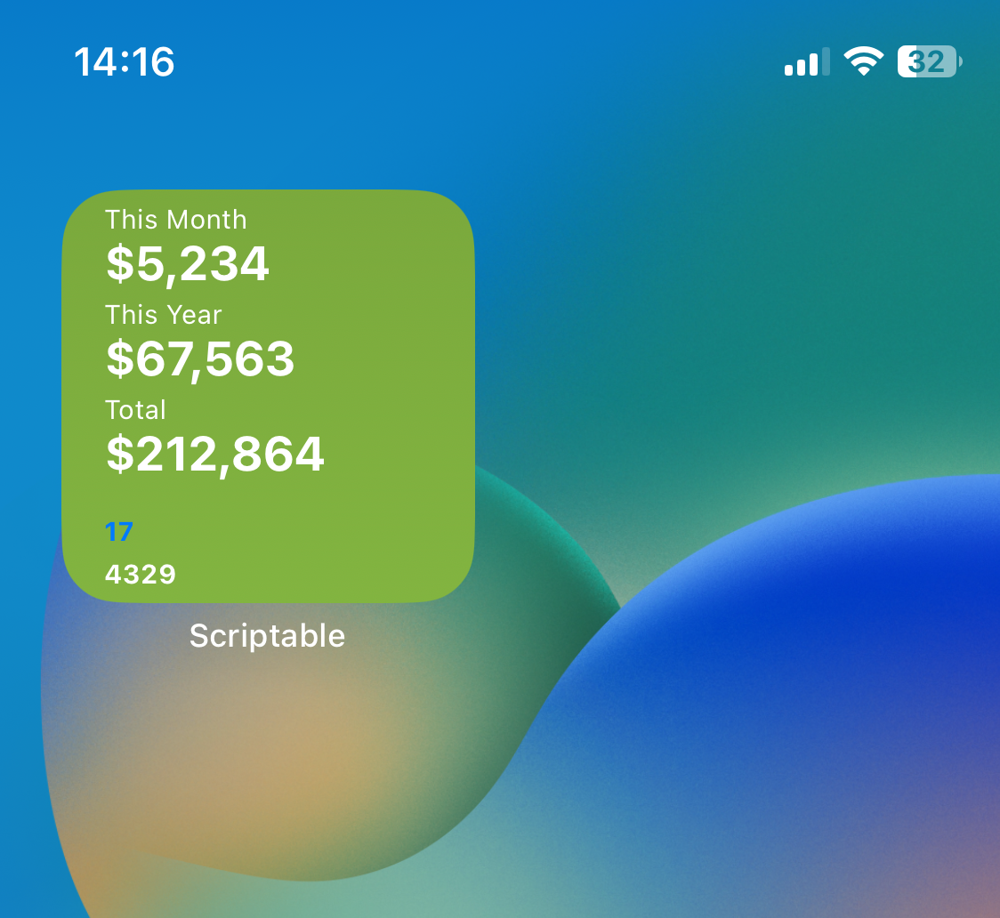

# Tools

## Verify Purchase Code

The Verify Purchase Code support for purchased item, the author will be available to the buyer, to iron out any potential issues of  have in using the item. 

- You can find your purchase code by visiting the Envato Market account and navigating to the "Download" section.

## Notifications

The Notifications allow you to receive notifications of new sales from your website.

### Slack

- Go to [Slack Webhook](https://api.slack.com/messaging/webhooks) and follow the instructions to create a new Slack app.
- Using Incoming Webhooks to post messages from external sources into Slack.
- Copy Webhook URL -> Paste to WebHook URL field -> Save changes.
- You can also choose to enable or disable the type of notifications that will be sent to your Slack app.

### Telegram

- Go to the documentation about [Telegram Bot](https://core.telegram.org/bots#6-botfather) and follow the instructions to create a new Bot.
- Get your Telegram Bot Token.
- After creating your bot, you must send a message to your group/channel, then click on the button "Get Chat ID" to get the list of chat IDs.
- You can also choose to enable or disable the type of notifications that will be sent to your Telegram app.

### WhatsApp

- Create a WhatsApp Business account.
- After that following documentation from [WhatsApp](https://developers.facebook.com/docs/whatsapp/overview) to get your access token.
- You can also choose to enable or disable the type of notifications that will be sent to your WhatsApp app.

## Scriptable

The Scriptable help you create a widget in iOS that shows your revenues for this year, this month, and the total.

- Download [Scriptable](https://scriptable.app/) and copy the code that has been generated from the website, paste it into the widget in the Scriptable app
- When you successfully installed a new widget will appear like the image below

