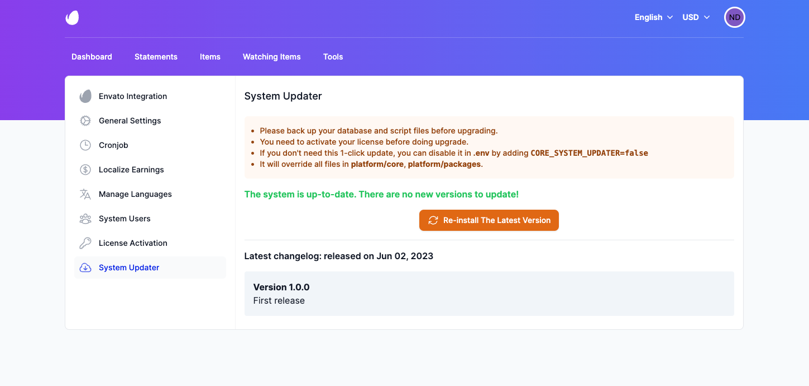

# Updating

## Automatic Updates

To update Envato Sale Tools, go to **Settings** -> **System Updater** and click the **Download & Install Update**
button if an update is available.

## Manual Updates

If you prefer to update manually, you can download the latest version of Envato Sale Tools from
your [CodeCanyon](https://codecanyon.net/downloads) account.

After downloading the latest version of Envato Sale Tools, extract the zip file and upload the contents to your server,
overwriting the existing files.
